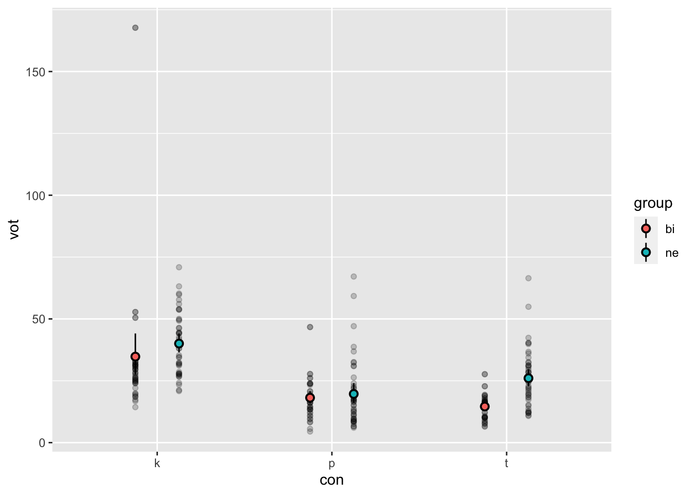
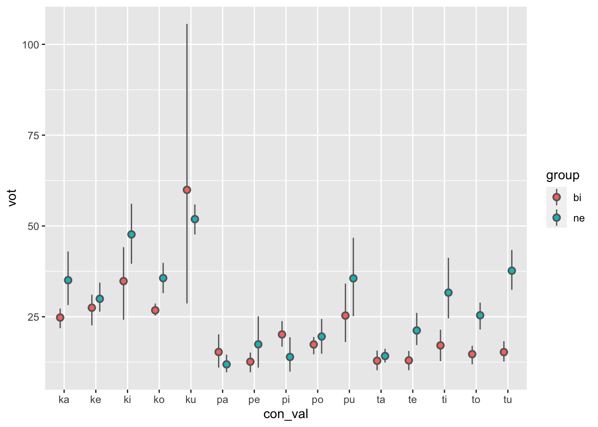

Programming assignment 4
================

**Author**: Jiawei Shao  
**Date**: Last update: 2022-04-18 18:57:25

# Overview

<!-- 
  Talk briefly about what you did here 
  Describe your hypotheses
-->

In this report, I imported the acoustic data generated by the 6
speakers. I manipulated the dataframe to test my hypothesis:

Bilingual participants will produce the stop consonants with a shorter
VOT in comparison with the L2 learners.

The acoustic data were analyzed using a general linear model.

# Prep

## Libraries

## Load data

``` r
# You need to get all the files in the 'data' directory and combine them
# Check previous examples we did in class 

bi01 <- read_csv('../data/bi01.csv')
```

    ## Rows: 45 Columns: 5
    ## ── Column specification ────────────────────────────────────────────────────────
    ## Delimiter: ","
    ## chr (2): fileID, notes
    ## dbl (3): f1, f2, vot
    ## 
    ## ℹ Use `spec()` to retrieve the full column specification for this data.
    ## ℹ Specify the column types or set `show_col_types = FALSE` to quiet this message.

``` r
bi02 <- read_csv('../data/bi02.csv')
```

    ## Rows: 45 Columns: 5
    ## ── Column specification ────────────────────────────────────────────────────────
    ## Delimiter: ","
    ## chr (1): fileID
    ## dbl (3): f1, f2, vot
    ## lgl (1): notes
    ## 
    ## ℹ Use `spec()` to retrieve the full column specification for this data.
    ## ℹ Specify the column types or set `show_col_types = FALSE` to quiet this message.

``` r
bi03 <- read_csv('../data/bi03.csv')
```

    ## Rows: 45 Columns: 5
    ## ── Column specification ────────────────────────────────────────────────────────
    ## Delimiter: ","
    ## chr (1): fileID
    ## dbl (3): f1, f2, vot
    ## lgl (1): notes
    ## 
    ## ℹ Use `spec()` to retrieve the full column specification for this data.
    ## ℹ Specify the column types or set `show_col_types = FALSE` to quiet this message.

``` r
ne01 <- read_csv('../data/ne01.csv')
```

    ## Rows: 45 Columns: 5
    ## ── Column specification ────────────────────────────────────────────────────────
    ## Delimiter: ","
    ## chr (1): fileID
    ## dbl (3): f1, f2, vot
    ## lgl (1): notes
    ## 
    ## ℹ Use `spec()` to retrieve the full column specification for this data.
    ## ℹ Specify the column types or set `show_col_types = FALSE` to quiet this message.

``` r
ne02 <- read_csv('../data/ne02.csv')
```

    ## Rows: 45 Columns: 5
    ## ── Column specification ────────────────────────────────────────────────────────
    ## Delimiter: ","
    ## chr (1): fileID
    ## dbl (3): f1, f2, vot
    ## lgl (1): notes
    ## 
    ## ℹ Use `spec()` to retrieve the full column specification for this data.
    ## ℹ Specify the column types or set `show_col_types = FALSE` to quiet this message.

``` r
ne03 <- read_csv('../data/ne03.csv')
```

    ## Rows: 45 Columns: 5
    ## ── Column specification ────────────────────────────────────────────────────────
    ## Delimiter: ","
    ## chr (1): fileID
    ## dbl (3): f1, f2, vot
    ## lgl (1): notes
    ## 
    ## ℹ Use `spec()` to retrieve the full column specification for this data.
    ## ℹ Specify the column types or set `show_col_types = FALSE` to quiet this message.

## Tidy data

``` r
# Convert from long to wide or wide to long format as necessary (check 
# examples from class)
# Create any other relevant variables here 

total <- rbind(bi01,bi01,bi03, ne01, ne02, ne03)
total_vot <-total %>% 
  select(fileID, vot) 

total_vars<-total_vot %>% 
  separate(., col = fileID, into = c("id", "stimuli"), sep = "_") %>%
  separate(., col = stimuli, into = c("con_val", "rep"), sep = 2) %>%  
  mutate(., copy_word = con_val) %>% 
  mutate(., participant = id) %>% 
  separate(., col = copy_word, into = c("con", "rest"), sep = 1) %>% 
  separate(., col = participant, into = c("group", "num"), sep = 2) %>% 
  select(id, group, con_val, con, vot)
```

# Analysis

## Descriptives

``` r
# Give some descriptive summaries of your data 
# Display your descriptive in a table (try knitr::kable())
total_vars %>% 
  group_by(group, con) %>% 
  summarize(vot_avg = mean(vot), sd_vot = sd(vot)) %>% 
  knitr::kable(format = "html")
```

    ## `summarise()` has grouped output by 'group'. You can override using the
    ## `.groups` argument.

<table>
<thead>
<tr>
<th style="text-align:left;">
group
</th>
<th style="text-align:left;">
con
</th>
<th style="text-align:right;">
vot\_avg
</th>
<th style="text-align:right;">
sd\_vot
</th>
</tr>
</thead>
<tbody>
<tr>
<td style="text-align:left;">
bi
</td>
<td style="text-align:left;">
k
</td>
<td style="text-align:right;">
34.76556
</td>
<td style="text-align:right;">
30.279366
</td>
</tr>
<tr>
<td style="text-align:left;">
bi
</td>
<td style="text-align:left;">
p
</td>
<td style="text-align:right;">
18.15244
</td>
<td style="text-align:right;">
8.435951
</td>
</tr>
<tr>
<td style="text-align:left;">
bi
</td>
<td style="text-align:left;">
t
</td>
<td style="text-align:right;">
14.59600
</td>
<td style="text-align:right;">
5.056154
</td>
</tr>
<tr>
<td style="text-align:left;">
ne
</td>
<td style="text-align:left;">
k
</td>
<td style="text-align:right;">
40.04267
</td>
<td style="text-align:right;">
12.428917
</td>
</tr>
<tr>
<td style="text-align:left;">
ne
</td>
<td style="text-align:left;">
p
</td>
<td style="text-align:right;">
19.67844
</td>
<td style="text-align:right;">
13.460351
</td>
</tr>
<tr>
<td style="text-align:left;">
ne
</td>
<td style="text-align:left;">
t
</td>
<td style="text-align:right;">
26.03578
</td>
<td style="text-align:right;">
11.714190
</td>
</tr>
</tbody>
</table>

``` r
total_vars %>% 
  group_by(group) %>% 
  summarize(vot_avg = mean(vot), sd_vot = sd(vot)) %>% 
  knitr::kable(format = "html")
```

<table>
<thead>
<tr>
<th style="text-align:left;">
group
</th>
<th style="text-align:right;">
vot\_avg
</th>
<th style="text-align:right;">
sd\_vot
</th>
</tr>
</thead>
<tbody>
<tr>
<td style="text-align:left;">
bi
</td>
<td style="text-align:right;">
22.50467
</td>
<td style="text-align:right;">
20.26483
</td>
</tr>
<tr>
<td style="text-align:left;">
ne
</td>
<td style="text-align:right;">
28.58563
</td>
<td style="text-align:right;">
15.10570
</td>
</tr>
</tbody>
</table>

## Visualization

``` r
# Include some plots here


total_vars %>% 
  ggplot(., aes(x = con, y = vot, fill = group)) + 
    geom_point(position = position_dodge(0.5), alpha = 0.2) + 
    stat_summary(fun.data = mean_cl_boot, geom = "pointrange", 
                 position = position_dodge(0.5), pch = 21) 
```



``` r
total_vars %>% 
  ggplot(., aes(x = con_val, y = vot, fill = group)) + 
    stat_summary(fun.data = mean_cl_boot, geom = "pointrange", color = "grey40", 
                 position = position_dodge(0.5), pch = 21) 
```



<!-- 
Also include a professional looking figure illustrating an example of the acoustics 
of the production data, i.e., a plot generated in praat.
You decide what is relevant (something related to your hypothesis). 
Think about where this file should be located in your project. 
What location makes most sense in terms of organization? 
How will you access the file (path) from this .Rmd file?
If you need help consider the following sources: 
  - Search 'Rmarkdown image' on google, stackoverflow, etc.
  - Search the 'knitr' package help files in RStudio
  - Search the internet for HTML code (not recommended, but it works)
  - Check the code from my class presentations (may or may not be helpful)
-->

## Hypothesis test

``` r
# Conduct a simple statistical analysis here (optional)
mod_full <- lm(vot ~ group * con, data = total_vars)
summary(mod_full)
```

    ## 
    ## Call:
    ## lm(formula = vot ~ group * con, data = total_vars)
    ## 
    ## Residuals:
    ##     Min      1Q  Median      3Q     Max 
    ## -20.426  -8.096  -2.381   4.152 132.944 
    ## 
    ## Coefficients:
    ##              Estimate Std. Error t value Pr(>|t|)    
    ## (Intercept)    34.766      2.346  14.817  < 2e-16 ***
    ## groupne         5.277      3.318   1.590    0.113    
    ## conp          -16.613      3.318  -5.007 1.01e-06 ***
    ## cont          -20.170      3.318  -6.078 4.23e-09 ***
    ## groupne:conp   -3.751      4.693  -0.799    0.425    
    ## groupne:cont    6.163      4.693   1.313    0.190    
    ## ---
    ## Signif. codes:  0 '***' 0.001 '**' 0.01 '*' 0.05 '.' 0.1 ' ' 1
    ## 
    ## Residual standard error: 15.74 on 264 degrees of freedom
    ## Multiple R-squared:  0.2576, Adjusted R-squared:  0.2436 
    ## F-statistic: 18.32 on 5 and 264 DF,  p-value: 1.306e-15

``` r
#test of the  fitted model 
mod_0 <- lm(vot ~ 1, data = total_vars)
mod_group <- lm(vot ~ group, data = total_vars)
mod_int <- lm(vot ~ group + con, data = total_vars)
# Test main effects and interaction'}
anova(mod_0, mod_group, mod_int, mod_full)
```

    ## Analysis of Variance Table
    ## 
    ## Model 1: vot ~ 1
    ## Model 2: vot ~ group
    ## Model 3: vot ~ group + con
    ## Model 4: vot ~ group * con
    ##   Res.Df   RSS Df Sum of Sq       F    Pr(>F)    
    ## 1    269 88101                                   
    ## 2    268 85605  1    2496.0 10.0751  0.001681 ** 
    ## 3    266 66531  2   19074.0 38.4957 2.136e-15 ***
    ## 4    264 65404  2    1127.5  2.2755  0.104753    
    ## ---
    ## Signif. codes:  0 '***' 0.001 '**' 0.01 '*' 0.05 '.' 0.1 ' ' 1

## **Result and discussion**

The acoustic data were analyzed using a general linear model. **Voice
onset time** (*vot*) was the criterion with **language group** (*bi* as
in bilingual or *ne*as in native English speaker) and **consonant type**
(*con*) as predictors. The **language group** factor was dummy coded
with *bi* group set as the reference group. Main effects and the
**language group** by **consonant type** interaction were assessed using
nested model comparisons. Experiment-wise alpha was set at 0.05.

There was a main effect of **language group** (F(1) = 10.0751, p &lt;
0.01), **consonant type** (F(1) = 38.4957; p &lt; 0.001), yet no
**language group** by **consonant type** interaction (F(1) = 2.2755; p
&gt; 0.1). The model containing the interaction provided the best fit of
the data (R2 = 0.2576). Overall, **Voice onset time** is shorter for
bilingual group speakers than L2 learners. However, the size of the
effect was modulated by **consonant type**.

# Conclusion

<!-- 
Revisit your hypotheses (refer to plots, figures, tables, statistical tests, 
etc.)

Reflect on the entire process. 
What did you enjoy? What did you hate? What did you learn? 
What would you do differently?
-->

My hypothesis is that bilingual participants will produce the stop
consonants with a shorter VOT in comparison with the L2 learners.

The two tables showing the descriptives of the acoustic data showed that
there is a difference between the general VOT from bilingual group and
L2 group, more specifically the bilingual group being shorter than the
L2 group. The condition of different consonant types was also checked
and it is found that the different consonant types indeed were produced
with different VOT.

The two plots showed the same descriptives in a visual manner, where we
can see with more details that consonant p shows a smaller inter-group
difference than k and t. Also, in certain consonant-vowel combination
the data showed that the bilingual group production has a longer VOT
than the L2 group: ku, pa, pi.

The statistical test showed main effects of language group and consonant
type, but no interaction.

I enjoyed the manipulation of the dataframe, and making plots. I’m lucky
in a way that I’m able to make use of formerly done PAs to solve this
one. It was a great opportunity to refresh my memory of what we have
learnt from the datasci class.

</br></br>
